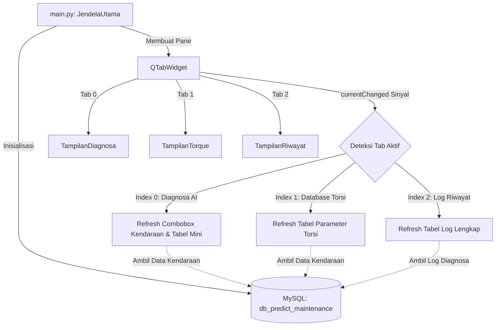
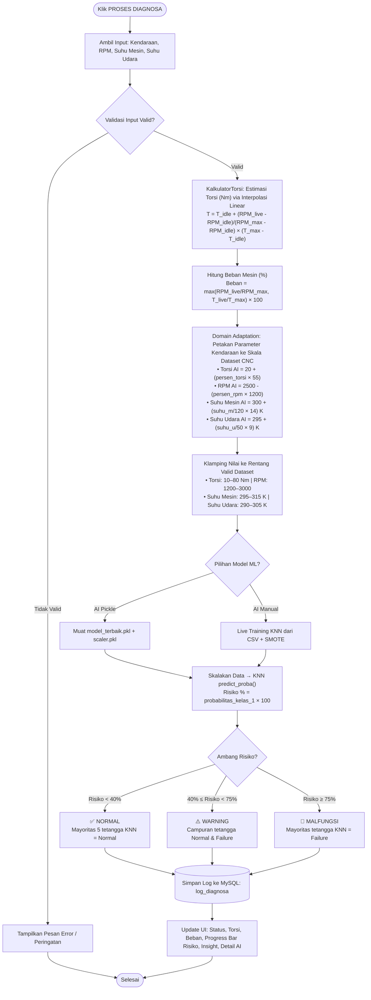
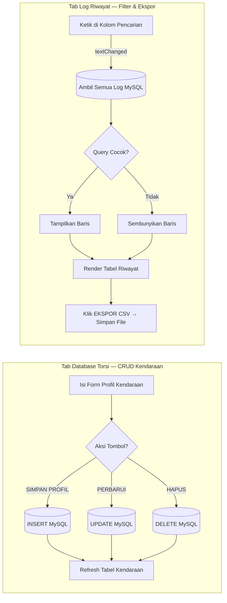

<div align="center">

# 🔧 Predictive Maintenance AI
### Diagnosa & Manajemen Kendaraan Berbasis Machine Learning

[](https://www.python.org/)
[](https://doc.qt.io/qtforpython/)
[](https://scikit-learn.org/)
[](https://www.mysql.com/)
[](LICENSE)
[](CHANGELOG.md)

> Aplikasi desktop berbasis **GUI (PySide6)** dan **Machine Learning (K-Nearest Neighbors)** untuk melakukan diagnosa pemeliharaan prediktif pada mesin kendaraan secara real-time. Sistem mengintegrasikan perhitungan torsi via interpolasi linear, domain adaptation dari konteks kendaraan ke dataset industri CNC, serta prediksi risiko kegagalan mesin melalui model **KNN + SMOTE**.

</div>

---

## 🛠️ Prasyarat Sistem (Prerequisites)

Sebelum menjalankan aplikasi, pastikan sistem Anda memiliki komponen berikut:

1. **Python 3.8 s/d 3.12+**
2. **MySQL Server** — bisa melalui [Laragon](https://laragon.org/), [XAMPP](https://www.apachefriends.org/), atau instalasi mandiri MySQL.

---

## 🚀 1. Panduan Instalasi & Dependensi

### A. Membuat dan Mengaktifkan Virtual Environment

Buka terminal/PowerShell di direktori proyek `predictive-maintenance`:

**Windows (PowerShell):**
```powershell
# Membuat virtual environment bernama .venv
python -m venv .venv

# Mengaktifkan virtual environment
.venv\Scripts\activate
```

**Windows (CMD):**
```cmd
.venv\Scripts\activate.bat
```

### B. Menginstal Pustaka Python

Setelah virtual environment aktif (terdapat tanda `(.venv)` di awal prompt), instal seluruh dependensi:

```bash
pip install PySide6 mysql-connector-python pandas scikit-learn imbalanced-learn
```

| Pustaka | Fungsi |
|---|---|
| `PySide6` | Framework GUI untuk membangun antarmuka desktop |
| `mysql-connector-python` | Koneksi dan query ke database MySQL |
| `pandas` | Membaca dan memanipulasi dataset CSV |
| `scikit-learn` | Model KNN (`KNeighborsClassifier`) dan scaler (`MinMaxScaler`) |
| `imbalanced-learn` | SMOTE untuk menyeimbangkan kelas data training |

---

## 🗄️ 2. Konfigurasi Database MySQL

Aplikasi menggunakan koneksi MySQL lokal dan akan **membuat database serta tabel secara otomatis** saat pertama kali dijalankan.

### Pengaturan Koneksi (`database/db_koneksi.py`):

| Parameter | Nilai Default |
|---|---|
| Host | `localhost` |
| User | `root` |
| Password | `""` (kosong) |
| Database | `db_predict_maintenance` |

> Jika konfigurasi MySQL Anda berbeda, ubah nilai-nilai tersebut di file `database/db_koneksi.py`.

### Tabel yang Dibuat Otomatis:

| Tabel | Isi |
|---|---|
| `torsi_kendaraan` | Profil spesifikasi kendaraan: nama, RPM idle, torsi maksimal, RPM maksimal |
| `log_diagnosa` | Riwayat hasil diagnosa: waktu, kendaraan, RPM, torsi estimasi, beban mesin, suhu mesin, suhu udara, risiko (%), status |

### Langkah Persiapan:
1. Pastikan **MySQL Server berjalan** (klik **Start** pada XAMPP/Laragon).
2. Tidak perlu membuat database secara manual — aplikasi akan menanganinya otomatis.

---

## 🗺️ 3. Arsitektur Kode Proyek

```
predictive-maintenance/
│
├── main.py                    # Entry point: inisialisasi window, tab, DB, dan tema QSS
├── style.qss                  # Tema dark mode global untuk seluruh widget Qt
├── model_terbaik.pkl          # Model KNN pre-trained (sudah di-SMOTE)
├── scaler.pkl                 # MinMaxScaler yang di-fit saat training
├── 2020 Predictive Maintenance Dataset.csv  # Dataset sumber training
│
├── database/
│   ├── db_koneksi.py          # Koneksi MySQL + CRUD kendaraan + logging diagnosa
│   └── models.py              # Kelas ProfileKendaraan (data model)
│
├── core/
│   ├── kalkulator_torsi.py    # Estimasi torsi via interpolasi linear (RPM → Nm)
│   ├── logika_diagnosa.py     # Pipeline utama: validasi → torsi → domain adaptation → KNN
│   ├── mesin_ai_base.py       # Base class: siapkan_data(), prediksi(), hitung_risiko()
│   ├── mesin_ai_pickle.py     # Model AI dari file .pkl (pre-trained, cepat)
│   └── mesin_ai_manual.py     # Model AI live training dari CSV + SMOTE (on-the-fly)
│
└── ui/
    ├── diagnostics_view.py    # Tab Diagnosa AI: form input + dashboard hasil KNN
    ├── torque_view.py         # Tab Database Torsi: CRUD profil kendaraan
    ├── history_view.py        # Tab Log Riwayat: tabel lengkap + cari + ekspor CSV
    └── styles.py              # Konstanta style header card
```

---

## 📊 4. Diagram Alur Sistem

### A. Arsitektur Utama & Mekanisme Tab



---

### B. Alur Pipeline Diagnosa AI (Lengkap)



---

### C. Siklus CRUD Database Torsi & Pencarian Riwayat



---

## 🏃 5. Cara Menjalankan Aplikasi

Ikuti seluruh langkah di bawah ini **secara berurutan** agar aplikasi dapat berjalan dan terhubung ke database dengan benar.

---

### ✅ Langkah 1 — Instal Python

Pastikan **Python 3.8 atau lebih baru** sudah terpasang di komputer Anda.

Cek versi Python dengan membuka terminal/PowerShell:

```powershell
python --version
```

Jika belum ada, unduh dari [https://www.python.org/downloads/](https://www.python.org/downloads/) dan centang opsi **"Add Python to PATH"** saat instalasi.

---

### ✅ Langkah 2 — Instal MySQL Server

Aplikasi membutuhkan MySQL Server yang berjalan di komputer lokal. Pilih salah satu:

| Pilihan | Link Unduh | Keterangan |
|---|---|---|
| **Laragon** *(direkomendasikan)* | [laragon.org](https://laragon.org/) | Ringan, mudah digunakan, MySQL sudah termasuk |
| **XAMPP** | [apachefriends.org](https://www.apachefriends.org/) | Paket lengkap Apache + MySQL + PHP |
| **MySQL Community** | [mysql.com](https://dev.mysql.com/downloads/mysql/) | Instalasi mandiri MySQL resmi |

Setelah terinstal, **pastikan MySQL Server dalam keadaan berjalan (Running)** sebelum membuka aplikasi.

- **Laragon:** Klik tombol **Start All** atau start MySQL saja
- **XAMPP:** Buka XAMPP Control Panel → klik **Start** di baris **MySQL**

---

### ✅ Langkah 3 — Instal Library Python

Buka terminal/PowerShell di folder proyek lalu jalankan perintah berikut:

```powershell
python -m pip install PySide6 mysql-connector-python pandas scikit-learn imbalanced-learn
```

Tunggu hingga semua paket selesai diunduh dan dipasang. Proses ini memerlukan koneksi internet dan mungkin memakan waktu 2–5 menit tergantung kecepatan internet.

**Daftar library yang diinstal:**

| Library | Versi Minimal | Fungsi dalam Aplikasi |
|---|---|---|
| `PySide6` | 6.x | Framework GUI untuk membangun tampilan desktop |
| `mysql-connector-python` | 8.x / 9.x | Koneksi dan eksekusi query ke MySQL |
| `pandas` | 1.5+ | Membaca file dataset CSV untuk training model |
| `scikit-learn` | 1.0+ | Model KNN dan MinMaxScaler |
| `imbalanced-learn` | 0.10+ | SMOTE untuk menyeimbangkan data training |

Verifikasi semua library berhasil terinstal:

```powershell
python -c "import PySide6, mysql.connector, pandas, sklearn, imblearn; print('Semua library OK!')"
```

Jika muncul `Semua library OK!` maka instalasi berhasil.

---

### ✅ Langkah 4 — Persiapan & Konfigurasi Database MySQL

#### 4A. Buat Database Secara Manual (via phpMyAdmin)

Meskipun aplikasi dapat membuat database secara otomatis, **disarankan membuat database terlebih dahulu** secara manual untuk menghindari error saat koneksi pertama kali.

1. Buka browser dan akses **phpMyAdmin**:
   - Laragon: `http://localhost/phpmyadmin`
   - XAMPP: `http://localhost/phpmyadmin`

2. Di panel kiri, klik **"New"** (atau tombol **"Buat Database Baru"**)

3. Isi nama database: **`db_predict_maintenance`**

4. Pilih collation: **`utf8_general_ci`** lalu klik **Buat**

---

#### 4B. Buat Tabel secara Manual (SQL)

Setelah database dibuat, klik tab **SQL** di phpMyAdmin dan jalankan query berikut untuk membuat kedua tabel yang dibutuhkan:

```sql
-- ============================================================
-- Tabel 1: Profil Spesifikasi Kendaraan
-- Menyimpan data kendaraan yang akan digunakan saat diagnosa
-- ============================================================
CREATE TABLE IF NOT EXISTS torsi_kendaraan (
    id         INT AUTO_INCREMENT PRIMARY KEY,
    nama       VARCHAR(255),
    idle_rpm   INT,
    max_torque INT,
    max_rpm    INT
);

-- ============================================================
-- Tabel 2: Log Riwayat Hasil Diagnosa
-- Menyimpan semua rekaman hasil pemeriksaan kendaraan
-- ============================================================
CREATE TABLE IF NOT EXISTS log_diagnosa (
    id          INT AUTO_INCREMENT PRIMARY KEY,
    tanggal     VARCHAR(255),
    nama_mobil  VARCHAR(255),
    rpm         INT,
    torsi       DOUBLE,
    beban       DOUBLE,
    suhu_mesin  DOUBLE,
    suhu_udara  DOUBLE,
    risiko      DOUBLE,
    status      VARCHAR(255)
);
```

Klik tombol **"Go"** / **"Jalankan"** → kedua tabel akan muncul di panel kiri.

**Struktur tabel yang terbentuk:**

**Tabel `torsi_kendaraan`:**

| Kolom | Tipe Data | Keterangan |
|---|---|---|
| `id` | INT AUTO_INCREMENT PK | Primary key otomatis |
| `nama` | VARCHAR(255) | Nama/model kendaraan |
| `idle_rpm` | INT | RPM mesin saat stasioner (idle) |
| `max_torque` | INT | Torsi puncak kendaraan (Nm) |
| `max_rpm` | INT | RPM batas maksimum / redline |

**Tabel `log_diagnosa`:**

| Kolom | Tipe Data | Keterangan |
|---|---|---|
| `id` | INT AUTO_INCREMENT PK | Primary key otomatis |
| `tanggal` | VARCHAR(255) | Waktu diagnosa (format: YYYY-MM-DD HH:MM:SS) |
| `nama_mobil` | VARCHAR(255) | Nama kendaraan yang didiagnosa |
| `rpm` | INT | RPM input dari mekanik |
| `torsi` | DOUBLE | Estimasi torsi hasil kalkulasi (Nm) |
| `beban` | DOUBLE | Persentase beban mesin (%) |
| `suhu_mesin` | DOUBLE | Suhu mesin yang diinput (°C) |
| `suhu_udara` | DOUBLE | Suhu udara yang diinput (°C) |
| `risiko` | DOUBLE | Persentase risiko dari model KNN (%) |
| `status` | VARCHAR(255) | Hasil diagnosa: NORMAL / WARNING / MALFUNGSI |

> **Info:** Jika Anda melewati langkah ini, aplikasi akan mencoba membuat tabel secara otomatis saat pertama dijalankan. Namun jika terjadi error koneksi, tabel tidak akan terbuat.

---

#### 4C. Sesuaikan Konfigurasi Koneksi di Kode Program

Buka file [`database/db_koneksi.py`](database/db_koneksi.py) dan sesuaikan parameter koneksi MySQL:

```python
self.koneksi = mysql.connector.connect(
    host="localhost",      # Alamat server MySQL (biasanya localhost)
    user="root",           # Username MySQL Anda
    password="",           # Password MySQL Anda (kosong = default Laragon/XAMPP)
    database="db_predict_maintenance"  # Nama database yang sudah dibuat
)
```

**Panduan nilai yang perlu disesuaikan:**

| Parameter | Nilai Default | Kapan Harus Diubah |
|---|---|---|
| `host` | `localhost` | Jika MySQL berjalan di komputer/server lain |
| `user` | `root` | Jika username MySQL Anda bukan `root` |
| `password` | `""` (kosong) | Jika MySQL Anda menggunakan password — isi dengan password Anda, contoh: `"admin123"` |
| `database` | `db_predict_maintenance` | Jangan diubah (harus sama dengan nama database yang dibuat di 4A) |

**Contoh jika menggunakan password:**
```python
self.koneksi = mysql.connector.connect(
    host="localhost",
    user="root",
    password="admin123",   # ← ganti dengan password MySQL Anda
    database="db_predict_maintenance"
)
```

---

#### 4D. Verifikasi Koneksi Database

Jalankan perintah berikut di terminal untuk memastikan Python dapat terhubung ke MySQL:

```powershell
python -c "import mysql.connector; db = mysql.connector.connect(host='localhost', user='root', password='', database='db_predict_maintenance'); print('Koneksi database OK!'); db.close()"
```

Jika muncul `Koneksi database OK!` maka konfigurasi database sudah benar dan siap digunakan.

---

### ✅ Langkah 5 — Jalankan Aplikasi

Setelah semua langkah di atas selesai, jalankan aplikasi dari folder proyek:

```powershell
python main.py
```

Output terminal yang muncul jika semuanya berhasil:

```
[UI] Tema berhasil dimuat.
[OK] Mesin AI (Mode Pickle / SMOTE) berhasil dinyalakan.
```

Jendela aplikasi GUI akan terbuka secara otomatis.

---

### ❗ Troubleshooting Umum

| Pesan Error | Penyebab | Solusi |
|---|---|---|
| `ModuleNotFoundError: No module named 'PySide6'` | Library belum terinstal | Jalankan ulang perintah `pip install` di Langkah 3 |
| `mysql.connector.errors.InterfaceError` | MySQL Server tidak berjalan | Start MySQL di Laragon / XAMPP Control Panel |
| `mysql.connector.errors.ProgrammingError: Access denied` | Username/password MySQL salah | Ubah `user` dan `password` di `database/db_koneksi.py` |
| `[ERROR] File model_terbaik.pkl tidak ditemukan` | File .pkl tidak ada di folder | Pastikan `model_terbaik.pkl` dan `scaler.pkl` ada di folder root proyek |
| Tabel kosong di Tab Diagnosa AI | Belum ada kendaraan di database | Tambahkan dulu profil kendaraan di **Tab Database Torsi** |

---

## 📋 6. Panduan Penggunaan Aplikasi

Aplikasi memiliki **3 tab** yang dapat diakses dari panel navigasi atas.

---

### 🤖 Tab 1 — Diagnosa AI

Tab ini adalah inti aplikasi untuk melakukan diagnosa prediktif kondisi mesin kendaraan.

#### Langkah-langkah Melakukan Diagnosa:

**① Isi Form Input Telemetri (panel kiri)**

| Field | Keterangan | Contoh |
|---|---|---|
| **Pilih Kendaraan** | Pilih profil kendaraan dari dropdown (data dari database) | Toyota Avanza |
| **RPM Mesin Saat Ini** | Masukkan RPM aktual yang terbaca di tachometer | `3000` |
| **Suhu Mesin (°C)** | Suhu mesin dari indikator suhu kendaraan | `90` |
| **Suhu Udara (°C)** | Suhu udara sekitar lingkungan pengujian | `32` |

> **Batas validasi:**
> - RPM: `0 – 20.000`
> - Suhu Mesin: `-20°C – 250°C`
> - Suhu Udara: `-20°C – 70°C`

**② Pilih Model Machine Learning (panel tengah)**

| Pilihan | Keterangan | Kecepatan |
|---|---|---|
| **AI Pickle (Model SMOTE)** | Memuat model KNN pre-trained dari `model_terbaik.pkl` | ⚡ Instan |
| **AI Manual (CSV)** | Melatih KNN secara langsung dari dataset CSV + SMOTE | 🐢 Beberapa detik |

**③ Klik Tombol `▶ PROSES DIAGNOSA`**

**④ Baca Hasil Dashboard (panel kanan)**

| Komponen | Penjelasan |
|---|---|
| **STATUS AI** | Hasil akhir: `NORMAL` (hijau) / `WARNING` (oranye) / `MALFUNGSI` (merah) |
| **Kalkulasi Torsi** | Estimasi torsi kendaraan (Nm) dari interpolasi linear berdasarkan RPM input |
| **Persentase Beban** | Seberapa keras mesin bekerja (0–100%), merah jika >85% |
| **Progress Bar Risiko** | Persentase risiko kerusakan dari KNN `predict_proba()` (0–100%) |
| **Insight & Keterangan** | Penjelasan alasan status dan saran mekanis |
| **Data Transparan AI** | Detail nilai RPM, torsi, suhu setelah dipetakan ke skala dataset CNC |

**⑤ Reset Form**

Klik `⟳ RESET FORMULIR` untuk mengosongkan semua input dan mengembalikan dashboard ke kondisi awal.

> **Catatan:** Setiap diagnosa yang berhasil (bukan ERROR) otomatis tersimpan ke database dan akan muncul di tabel riwayat mini bagian bawah halaman.

---

### 🗃️ Tab 2 — Database Torsi

Tab ini digunakan untuk mengelola **profil spesifikasi kendaraan** yang akan digunakan saat diagnosa.

#### Cara Menambah Kendaraan Baru:

1. **Isi form** di panel kiri:

   | Field | Keterangan | Contoh |
   |---|---|---|
   | **Nama Kendaraan** | Nama identifikasi kendaraan | `Toyota Avanza 2019` |
   | **RPM Idle (Stasioner)** | RPM mesin saat kondisi diam/stasioner | `750` |
   | **Torsi Puncak (Nm)** | Torsi maksimum kendaraan (lihat buku manual) | `140` |
   | **RPM Batas Maksimal (Redline)** | Batas RPM tertinggi mesin (redline) | `6000` |

2. Klik tombol **`SIMPAN PROFIL`** → data tersimpan ke database dan tabel kanan diperbarui otomatis.

#### Cara Mengedit atau Menghapus Data Kendaraan:

1. **Klik baris** di tabel kanan → form kiri terisi otomatis dengan data kendaraan tersebut.
2. Tombol `PERBARUI`, `HAPUS`, dan `BATAL` akan muncul menggantikan tombol `SIMPAN PROFIL`.

| Tombol | Fungsi |
|---|---|
| **PERBARUI** | Menyimpan perubahan data kendaraan yang sedang dipilih |
| **HAPUS** | Menghapus data kendaraan dari database (minta konfirmasi) |
| **BATAL** | Membatalkan seleksi dan mengosongkan form kembali |

> **Penting:** Kendaraan yang sudah dihapus tidak dapat digunakan di tab Diagnosa AI. Pastikan tidak ada log penting yang bergantung pada kendaraan tersebut sebelum menghapus.

---

### 📜 Tab 3 — Log Riwayat

Tab ini menampilkan **seluruh rekaman riwayat diagnosa** yang pernah dilakukan, dari yang terbaru hingga terlama.

#### Kolom Data Riwayat:

| Kolom | Keterangan |
|---|---|
| **Waktu** | Jam:menit:detik saat diagnosa dilakukan |
| **Kendaraan** | Nama kendaraan yang didiagnosa |
| **RPM** | RPM yang diinput saat diagnosa |
| **Torsi (Nm)** | Estimasi torsi hasil kalkulasi |
| **Beban (%)** | Persentase beban mesin |
| **Suhu M (°C)** | Suhu mesin saat diagnosa |
| **Suhu U (°C)** | Suhu udara saat diagnosa |
| **Risiko (%)** | Persentase risiko kerusakan dari model KNN |
| **Status Akhir** | `NORMAL` / `WARNING` / `MALFUNGSI` (berwarna) |

#### Fitur-fitur Tab Riwayat:

**🔍 Pencarian Dinamis**
- Ketik kata kunci di kolom **"Cari Riwayat..."** → tabel otomatis difilter secara real-time.
- Pencarian bersifat *case-insensitive* dan mencakup **semua kolom** (nama kendaraan, status, tanggal, dll).

**⟳ Perbarui Data**
- Klik tombol **`⟳ PERBARUI DATA`** untuk memuat ulang data terbaru dari database.

**↓ Ekspor CSV**
- Klik tombol **`↓ EKSPOR CSV`** → dialog simpan file akan terbuka.
- File CSV yang dihasilkan berisi **data yang sedang ditampilkan** (termasuk hasil filter pencarian).
- Cocok untuk membuat laporan pemeriksaan berkala.

**✕ Hapus Riwayat**
- Klik tombol **`✕ HAPUS RIWAYAT`** → muncul dialog konfirmasi.
- Jika dikonfirmasi, **seluruh data log** akan dihapus permanen dari database (TRUNCATE).

> ⚠️ **Perhatian:** Penghapusan riwayat bersifat permanen dan tidak dapat dibatalkan. Ekspor data ke CSV terlebih dahulu jika diperlukan sebagai backup.

---

## 🧠 7. Penjelasan Teknis Algoritma KNN

### Cara Kerja Model K-Nearest Neighbors (k=5):

1. **Pelatihan:** Model belajar dari dataset `2020 Predictive Maintenance Dataset.csv` yang berisi data sensor mesin industri CNC (RPM, suhu proses, suhu udara, torsi) beserta labelnya (0=Normal, 1=Failure).

2. **SMOTE:** Dataset asli sangat tidak seimbang (~97% Normal vs ~3% Failure). SMOTE membuat sampel sintetis pada kelas minoritas agar model tidak bias.

3. **Scaling:** Semua fitur dinormalisasi ke rentang `[0, 1]` menggunakan `MinMaxScaler` sebelum pelatihan dan prediksi.

4. **Prediksi:** Saat mendiagnosa, model mencari **5 tetangga terdekat** di ruang fitur ber-skala menggunakan jarak Euclidean. Proporsi tetangga berkelas Failure menentukan persentase risiko:

   ```
   Risiko (%) = (jumlah tetangga berkelas Failure / 5) × 100
   ```

5. **Ambang Keputusan:**

   | Risiko | Status | Interpretasi |
   |---|---|---|
   | `< 40%` | ✅ NORMAL | Mayoritas 5 tetangga = Normal |
   | `40% – 74%` | ⚠️ WARNING | Campuran tetangga Normal & Failure |
   | `≥ 75%` | 🚨 MALFUNGSI | Mayoritas tetangga = Failure |

### Domain Adaptation (Pemetaan Kendaraan → Dataset CNC):

Dataset menggunakan data mesin industri CNC, bukan kendaraan. Sistem memetakan beban kerja kendaraan ke rentang dataset agar KNN dapat membandingkan dengan data historis yang relevan:

| Parameter | Rumus Pemetaan | Rentang Valid |
|---|---|---|
| **Torsi AI** | `20 + (persen_torsi × 55) Nm` | 10 – 80 Nm |
| **RPM AI** | `2500 - (persen_rpm × 1200) RPM` | 1200 – 3000 RPM |
| **Suhu Mesin AI** | `300 + (suhu_m / 120 × 14) K` | 295 – 315 K |
| **Suhu Udara AI** | `295 + (suhu_u / 50 × 9) K` | 290 – 305 K |

---

## 📁 8. File Penting di Root Proyek

| File | Fungsi |
|---|---|
| `model_terbaik.pkl` | Model KNN pre-trained dengan SMOTE — jangan hapus |
| `scaler.pkl` | MinMaxScaler yang di-fit saat training — harus sepasang dengan model |
| `2020 Predictive Maintenance Dataset.csv` | Dataset sumber untuk mode AI Manual |
| `style.qss` | Tema dark mode visual seluruh aplikasi |

---

## ⚙️ 9. Troubleshooting

| Masalah | Solusi |
|---|---|
| `mysql.connector.errors.DatabaseError` | Pastikan MySQL Server berjalan dan konfigurasi di `db_koneksi.py` benar |
| `[ERROR] File model_terbaik.pkl tidak ditemukan` | Pastikan file `.pkl` ada di folder root proyek (sejajar dengan `main.py`) |
| `[ERROR] File CSV tidak ditemukan` | Pastikan `2020 Predictive Maintenance Dataset.csv` ada di root proyek (diperlukan mode AI Manual) |
| Aplikasi crash saat startup | Pastikan semua dependensi sudah terinstal dengan benar di virtual environment aktif |
| Tabel kosong di tab Diagnosa | Tambahkan minimal 1 data kendaraan di **Tab Database Torsi** terlebih dahulu |

---

## 🤝 10. Kontribusi

Kontribusi sangat disambut! Silakan ikuti langkah-langkah berikut:

1. **Fork** repositori ini
2. Buat **branch baru** untuk fitur/perbaikan Anda:
   ```bash
   git checkout -b fitur/nama-fitur-baru
   ```
3. **Commit** perubahan Anda dengan pesan yang jelas:
   ```bash
   git commit -m "feat: tambahkan fitur X untuk Y"
   ```
4. **Push** ke branch Anda:
   ```bash
   git push origin fitur/nama-fitur-baru
   ```
5. Buat **Pull Request** ke branch `main`

> Silakan baca [CHANGELOG.md](CHANGELOG.md) untuk melihat riwayat perubahan dan [SECURITY.md](SECURITY.md) untuk panduan pelaporan kerentanan keamanan.

### Konvensi Commit Message

| Prefix | Digunakan Untuk |
|---|---|
| `feat:` | Menambahkan fitur baru |
| `fix:` | Memperbaiki bug |
| `docs:` | Perubahan dokumentasi |
| `refactor:` | Refaktor kode (tanpa perubahan fungsional) |
| `perf:` | Peningkatan performa |
| `chore:` | Tugas pemeliharaan (update dependensi, dll.) |

---

## 📄 11. Lisensi

Proyek ini dilisensikan di bawah **MIT License** — lihat file [LICENSE](LICENSE) untuk detail lengkap.

```
MIT License © 2026 hafistafrizal
```

---

## 🙏 12. Acknowledgements

- **Dataset:** [AI4I 2020 Predictive Maintenance Dataset](https://archive.ics.uci.edu/dataset/601/ai4i+2020+predictive+maintenance+dataset) — UCI Machine Learning Repository
- **Framework GUI:** [PySide6](https://doc.qt.io/qtforpython/) (Qt for Python)
- **Machine Learning:** [scikit-learn](https://scikit-learn.org/) & [imbalanced-learn](https://imbalanced-learn.org/)
- **Inspirasi:** Teknik domain adaptation untuk menghubungkan data industri CNC ke konteks kendaraan otomotif

---

<div align="center">

Dibuat dengan ❤️ oleh **[hafistafrizal](https://github.com/hafistafrizal)**

⭐ **Jika proyek ini bermanfaat, berikan bintang!** ⭐

[](https://github.com/hafistafrizal/predictive-maintenance/stargazers)

</div>

