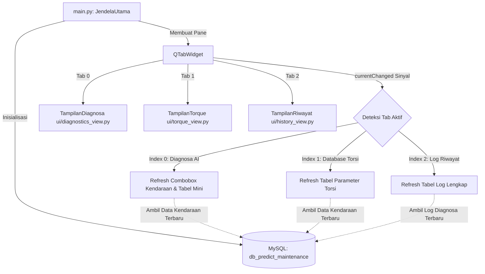
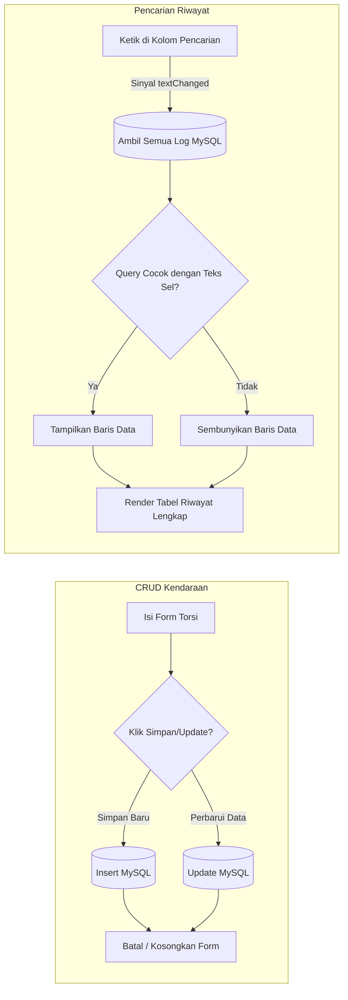

# Sistem Predictive Maintenance AI (Manajemen & Diagnosa Kendaraan)

Proyek ini adalah aplikasi desktop berbasis GUI (**PySide6**) dan **Machine Learning (K-Nearest Neighbors)** untuk melakukan diagnosa pemeliharaan prediktif pada mesin kendaraan. Aplikasi ini mengelola data spesifikasi kendaraan, menghitung estimasi torsi berdasarkan RPM input menggunakan interpolasi linear, memetakan data kendaraan ke skala dataset industri CNC, mengevaluasi potensi kegagalan mesin via model KNN (SMOTE), dan menyimpan log pencatatan ke database MySQL.

---

## 🛠️ Prasyarat Sistem (Prerequisites)

Sebelum menjalankan aplikasi, pastikan sistem Anda memiliki komponen berikut:
1. **Python 3.8 s/d 3.12+**
2. **MySQL Server** (bisa melalui Laragon, XAMPP, atau instalasi mandiri MySQL).

---

## 🚀 1. Panduan Instalasi & Dependensi

Ikuti langkah-langkah di bawah ini untuk menyiapkan lingkungan virtual Python (*virtual environment*) dan menginstal pustaka yang diperlukan.

### A. Membuat dan Mengaktifkan Virtual Environment
Buka terminal/Command Prompt di direktori proyek `predictive-maintenance` Anda:

**Windows (PowerShell):**
```powershell
# Membuat virtual environment bernama .venv (jika belum ada)
python -m venv .venv

# Mengaktifkan virtual environment
.venv\Scripts\activate
```

**Windows (CMD):**
```cmd
# Mengaktifkan virtual environment
.venv\Scripts\activate.bat
```

### B. Menginstal Pustaka Python
Setelah virtual environment aktif (terdapat tanda `(.venv)` di awal prompt terminal), pasang seluruh dependensi utama dan library pendukung data science dengan menjalankan:
```bash
pip install PySide6 mysql-connector-python pandas scikit-learn imbalanced-learn
```

---

## 🗄️ 2. Konfigurasi Database MySQL

Aplikasi ini menggunakan modul otomatis untuk mendeteksi, membuat database, dan membangun tabel secara mandiri saat dijalankan pertama kali.

### Konfigurasi Koneksi (`database/db_koneksi.py`):
* **Host:** `localhost`
* **User:** `root`
* **Password:** `""` (Kosong)
* **Database Name:** `db_predict_maintenance`

### Langkah-langkah Persiapan:
1. **Jalankan MySQL Server** (misalnya, klik tombol **Start** pada modul **MySQL** di XAMPP Control Panel).
2. Sistem akan otomatis mendeteksi jika database `db_predict_maintenance` belum ada dan akan membuatnya secara otomatis.
3. Tabel yang otomatis dibuat adalah:
   - **`torsi_kendaraan`**: Menyimpan spesifikasi dasar profil kendaraan (Nama, RPM Idle, Torsi Maksimal, RPM Maksimal).
   - **`log_diagnosa`**: Menyimpan riwayat hasil pemrosesan diagnosa AI (Waktu, Nama Mobil, RPM, Torsi Estimasi, Beban Mesin, Suhu Mesin, Suhu Udara, Risiko Kerusakan, Status Akhir).

---

## 🗺️ 3. Arsitektur Kode Proyek

Proyek ini dibangun menggunakan pola modular untuk memisahkan logika pemrosesan, penyimpanan data, dan antarmuka pengguna:

* **`main.py`** - Titik masuk (*entry point*) utama aplikasi. Mengatur jendela utama (`QMainWindow`), inisialisasi koneksi database, memuat file tema `style.qss`, dan mengelola tab menu (`QTabWidget`).
* **`style.qss`** - Lembar gaya (Stylesheet) global aplikasi bertema gelap premium (Dark Mode) untuk seluruh widget Qt.
* **`latih_ulang.py`** - Skrip untuk melatih ulang model KNN menggunakan data historis pabrik pada file CSV dan menyimpannya kembali ke file pickle.
* **`database/`**
  - **`db_koneksi.py`** - Menangani koneksi ke database server MySQL dan mengeksekusi operasi CRUD (Create, Read, Update, Delete) data kendaraan serta log diagnosa.
  - **`models.py`** - Definisi data model kelas `ProfileKendaraan`.
* **`core/`** (Logika AI & Kalkulator)
  - **`kalkulator_torsi.py`** - Menghitung estimasi torsi real-time pada RPM tertentu menggunakan interpolasi linear berdasarkan parameter profil kendaraan.
  - **`logika_diagnosa.py`** - Modul pusat diagnosa. Melakukan validasi input, menghitung beban kerja mesin, mengonversi skala telemetri mobil ke skala dataset industri CNC (Domain Adaptation), memanggil model KNN, serta merumuskan saran mekanis.
  - **`mesin_ai_pickle.py`** - Mesin AI yang memuat model KNN terlatih dari `model_terbaik.pkl` dan penskalaan data `scaler.pkl`.
  - **`mesin_ai_manual.py`** - Mesin AI alternatif yang melatih model KNN secara langsung dari dataset CSV secara on-the-fly.
* **`ui/`** (Antarmuka Pengguna)
  - **`diagnostics_view.py`** - Tampilan panel diagnosa telemetri, model ML, dashboard hasil, progress bar risiko, dan tabel riwayat mini.
  - **`torque_view.py`** - Tampilan pengelolaan spesifikasi profil kendaraan (Form input CRUD, tabel database parameter torsi).
  - **`history_view.py`** - Tampilan lengkap tabel log riwayat pemeriksaan kendaraan dilengkapi dengan fitur pencarian real-time dan ekspor laporan ke file CSV.

---

## 📊 4. Diagram Alur Sistem (Flowcharts)

Berikut adalah visualisasi alur kerja spesifik dari sistem ini:

### A. Arsitektur Utama & Mekanisme Tab
Diagram di bawah ini menggambarkan bagaimana `main.py` bertindak sebagai koordinator utama yang menghubungkan database dengan antarmuka tab, serta mengaktifkan fungsi sinkronisasi otomatis ketika tab berganti.



---

### B. Alur Logika Proses Diagnosa AI
Diagram ini menjelaskan urutan pemrosesan dari saat tombol **PROSES DIAGNOSA** ditekan, melakukan kalkulasi matematika torsi, konversi domain agar dapat dibaca AI, pemrosesan klasifikasi KNN, pembentukan saran mekanik, hingga penyimpanan riwayat ke database.

```mermaid
flowchart TD
    Start([Pengguna Mengklik PROSES DIAGNOSA]) --> Input[Ambil Input: Kendaraan Terpilih, RPM, Suhu Mesin, Suhu Udara]
    Input --> Validasi{Validasi Nilai Input?}
    
    Validasi -- Tidak --> Error[Tampilkan Pesan Peringatan/Error] --> End([Selesai])
    
    Validasi -- Ya --> CalcTorsi[KalkulatorTorsi: Hitung Estimasi Torsi via Interpolasi Linear]
    CalcTorsi --> CalcBeban[Hitung Persentase Beban Mesin: Rasio RPM & Torsi Puncak]
    
    CalcBeban --> DomainAdapt[Domain Adaptation: Konversi Unit Kendaraan ke Skala Dataset CNC]
    note1[Konversi Suhu ke Kelvin K, Pemetaan Torsi & RPM ke rentang KNN] --> DomainAdapt
    
    DomainAdapt --> AI_Select{Pilihan Model ML?}
    AI_Select -->|AI Pickle| KNN_Pickle[Muat model_terbaik.pkl & scaler.pkl]
    AI_Select -->|AI Manual| KNN_Manual[Latih KNN secara on-the-fly dari CSV Dataset]
    
    KNN_Pickle --> RunKNN[Jalankan Prediksi KNN: Dapatkan Probabilitas Risiko Kerusakan %]
    KNN_Manual --> RunKNN
    
    RunKNN --> Decision{Rasio Risiko %?}
    Decision -->|Risiko < 40%| Normal[Status: NORMAL | Insight: Aman, Operasional Optimal]
    Decision -->|40% <= Risiko < 75%| Warning[Status: WARNING | Insight: Waspada Anomali Suhu/Beban]
    Decision -->|Risiko >= 75%| Malfungsi[Status: MALFUNGSI | Insight: Bahaya Kegagalan Sistem Absolut]
    
    Normal --> SaveDB[Simpan Log ke database MySQL: log_diagnosa]
    Warning --> SaveDB
    Malfungsi --> SaveDB
    
    SaveDB --> ShowUI[Render ke UI: Update Status Teks, Progres Bar Risiko, Detail Konversi, & Tabel Mini]
    ShowUI --> End
```

---

### C. Siklus CRUD Database Torsi & Pencarian Riwayat
Diagram ini memvisualisasikan bagaimana penambahan kendaraan dikelola dan bagaimana riwayat diagnosa dapat disaring secara dinamis menggunakan input pencarian multi-kolom di tab Log Riwayat.



---

## 🏃 5. Cara Menjalankan Aplikasi & Uji Coba

### A. Menjalankan Tampilan GUI Utama
Untuk membuka antarmuka visual utama dari aplikasi predictive maintenance, pastikan virtual environment telah diaktifkan lalu jalankan:
```bash
python main.py
```

### B. Menjalankan Skrip Simulasi Kalkulator (Terminal / CLI)
Anda juga dapat menjalankan simulasi perhitungan torsi linear berdasarkan RPM untuk kendaraan uji coba langsung di terminal tanpa membuka GUI:
```bash
python test_kalkulator.py
```

### C. Melatih Ulang Model Machine Learning
Apabila Anda ingin melatih ulang kecerdasan model KNN menggunakan dataset CSV terbaru (misalnya mengubah parameter SMOTE atau jumlah tetangga terdekat `n_neighbors`), jalankan:
```bash
python latih_ulang.py
```
Skrip ini akan memperbarui file `model_terbaik.pkl` dan `scaler.pkl` secara otomatis.
